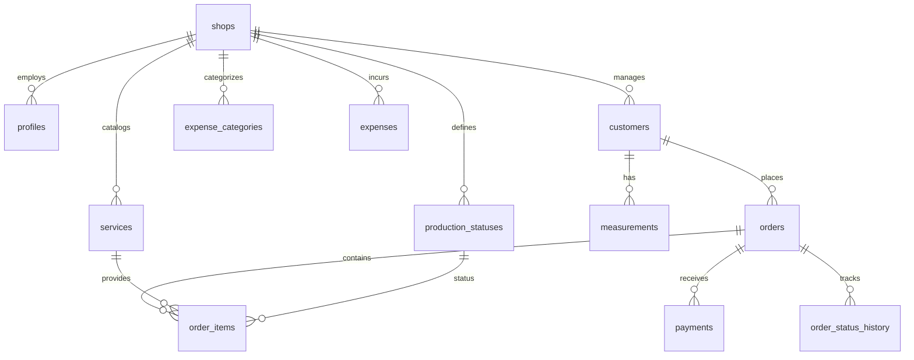

# Database Documentation — Mohit Tailoring POS

## Overview & Multi-Shop PostgreSQL Design
Mohit Tailoring POS uses a PostgreSQL database schema hosted on Supabase. Every business table includes `shop_id UUID REFERENCES shops(id)` to support multi-shop scaling and strict Row Level Security (RLS) isolation.

---

## Entity Relationship Diagram (ERD)



---

## Relational Tables Specification

### 1. `shops`
Master table for tailoring shop accounts.
- `id` (UUID, Primary Key)
- `name` (VARCHAR 255)
- `phone` (VARCHAR 50)
- `email` (VARCHAR 255)
- `address` (TEXT)
- `currency` (VARCHAR 10, default `'INR'`)
- `timezone` (VARCHAR 50, default `'Asia/Kolkata'`)
- `created_at`, `updated_at` (TIMESTAMPTZ)

### 2. `profiles`
Links Supabase Auth (`auth.users`) to shop access and RBAC roles.
- `id` (UUID, Primary Key)
- `auth_user_id` (UUID, UNIQUE REFERENCES `auth.users(id)`)
- `shop_id` (UUID REFERENCES `shops(id)`)
- `full_name` (VARCHAR 255)
- `email` (VARCHAR 255)
- `phone` (VARCHAR 50)
- `role` (`user_role` ENUM: `'OWNER'`, `'CRM'`, `'WORKER'`)
- `is_active` (BOOLEAN, default `true`)

### 3. `customers`
Customer directory. Soft deletion via `is_deleted = true` preserves order history.
- `id` (UUID, Primary Key)
- `shop_id` (UUID REFERENCES `shops(id)`)
- `name` (VARCHAR 255)
- `phone` (VARCHAR 50, Indexed)
- `country_code` (VARCHAR 10, default `'+91'`)
- `email` (VARCHAR 255)
- `address` (TEXT)
- `notes` (TEXT)
- `is_deleted` (BOOLEAN, default `false`)

### 4. `measurements`
Reusable customer measurement profiles per garment category.
- `id` (UUID, Primary Key)
- `shop_id` (UUID REFERENCES `shops(id)`)
- `customer_id` (UUID REFERENCES `customers(id)`)
- `garment_type` (VARCHAR 50: `GOWN`, `BLOUSE`, `TOP`, `SHIRT`, `PANT`, `CUSTOM`)
- `measurements` (JSONB)
- `notes` (TEXT)
- `is_customer_supplied` (BOOLEAN)

### 5. `services`
Catalog of default tailoring services and prices.
- `id` (UUID, Primary Key)
- `shop_id` (UUID REFERENCES `shops(id)`)
- `name` (VARCHAR 255)
- `description` (TEXT)
- `default_price` (NUMERIC 10, 2)
- `category` (VARCHAR 100)
- `is_active` (BOOLEAN)

### 6. `orders`
Primary sales & stitching orders transaction table.
- `id` (UUID, Primary Key)
- `shop_id` (UUID REFERENCES `shops(id)`)
- `customer_id` (UUID REFERENCES `customers(id)`)
- `invoice_number` (VARCHAR 50, UNIQUE per shop)
- `order_date`, `due_date` (DATE)
- `subtotal`, `discount`, `total_amount`, `total_paid`, `balance_amount` (NUMERIC 10, 2)
- `discount_type` (`discount_type` ENUM: `amount`, `percentage`)
- `measurement_snapshot` (JSONB — immutable historical snapshot taken at order placement)
- `notes` (TEXT)
- `status` (VARCHAR 50)
- `created_by` (UUID REFERENCES `profiles(id)`)

### 7. `order_items`
Line items within an order with historical snapshotting.
- `id` (UUID, Primary Key)
- `shop_id` (UUID REFERENCES `shops(id)`)
- `order_id` (UUID REFERENCES `orders(id)`)
- `service_id` (UUID REFERENCES `services(id)`)
- `service_name_snapshot` (VARCHAR 255)
- `quantity`, `unit_price`, `line_total` (NUMERIC 10, 2)
- `production_status_id` (UUID REFERENCES `production_statuses(id)`)
- `status` (VARCHAR 50)

### 8. `payments`
Multiple payment logs per order.
- `id` (UUID, Primary Key)
- `shop_id` (UUID REFERENCES `shops(id)`)
- `order_id` (UUID REFERENCES `orders(id)`)
- `amount` (NUMERIC 10, 2)
- `payment_method` (`payment_method` ENUM: `CASH`, `UPI`, `CARD`, `BANK_TRANSFER`, `OTHER`)
- `reference_number` (VARCHAR 100)
- `paid_at` (TIMESTAMPTZ)
- `created_by` (UUID REFERENCES `profiles(id)`)

### 9. `production_statuses`
Global shopfloor pipeline workflow.
- `id` (UUID, Primary Key)
- `shop_id` (UUID REFERENCES `shops(id)`)
- `name` (VARCHAR 50)
- `sort_order` (INT)
- `is_active` (BOOLEAN)
- `is_system` (BOOLEAN)

### 10. `order_status_history`
Audit trail of status transitions for shop analytics.
- `id` (UUID, Primary Key)
- `shop_id`, `order_id`, `order_item_id`, `status_id`, `changed_by`
- `status_name` (VARCHAR 50)
- `changed_at` (TIMESTAMPTZ)

### 11. `expense_categories` & 12. `expenses`
Category catalog and expense logs.

### 13. `notifications`
Queue for future WhatsApp Cloud API messaging.

### 14. `shop_settings`
Dynamic key-value JSONB settings.

---

## JSONB Measurement Schema Example
```json
{
  "gown": {
    "length": "56\"",
    "shoulder": "15\"",
    "sleeve": "22\"",
    "bust": "36\"",
    "waist": "30\"",
    "hip": "38\"",
    "armHole": "16\"",
    "neck": "7\""
  },
  "blouse": {
    "length": "14\"",
    "shoulder": "15\"",
    "sleeve": "10\"",
    "bust": "36\"",
    "waist": "30\"",
    "suppliedGarment": false
  }
}
```

---

## PostgreSQL Analytics RPC Functions

Migration: `20260922000100_analytics_rpc.sql`

- `get_dashboard_summary()`: Summarizes today's revenue, total sales, pending orders, ready orders, outstanding balance, today's expenses, and estimated net using shop timezone (`Asia/Kolkata`). Restricts financial output for `WORKER` role.
- `get_revenue_trend(p_period text)`: Aggregates sales totals by `Day`, `Week`, `Month`, or `Year`.
- `get_order_status_summary()`: Returns order line item counts grouped by active production status stage.
- `get_expense_summary(p_start_date date, p_end_date date)`: Calculates total expenses, count, average, and category breakdown.
- `get_service_analytics()`: Groups top stitching services using historical `service_name_snapshot`.
- `get_overdue_orders()`: Returns count and balance of overdue active orders (`due_date < CURRENT_DATE` and `status != 'DELIVERED'`).
